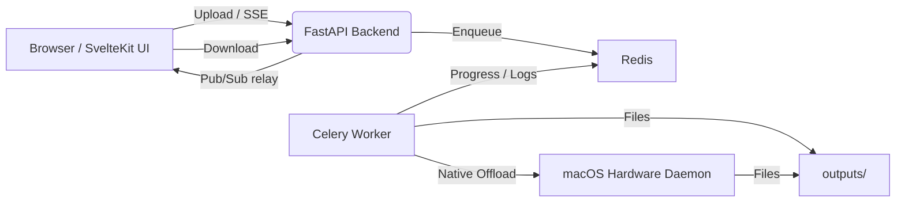

# Architecture, Sizing & Performance Limits

Understanding how the backend evaluates bounds translates directly to hardware provisioning choices. The stack's primary bottleneck rests on NVENC capabilities and/or sheer CPU matrix parsing speeds.

---

### Sizing and VRAM Limits

The `WORKER_CONCURRENCY` defines how many parallel videos the background worker evaluates simultaneously.

| Environment Hardware | Concurrency Limit | Architectural Considerations |
|-----|------------------------|-------|
| NVIDIA RTX 5090 / 5070 Ti | 8–16 jobs | 9th Gen NVENC (x2). Maximize I/O SSDs to avoid bottlenecking. |
| NVIDIA RTX 4090 / 4080 / 4070 Ti | 8–12 jobs | 8th Gen NVENC, excellent AV1 pipeline throughput |
| NVIDIA RTX 3090 / 3080 / 3070 | 6–10 jobs | 7th Gen NVENC (No hardware AV1 processing) |
| NVIDIA RTX 2080 Ti / 2070 / 2060 | 3–5 jobs | 6th Gen NVENC |
| Baseline CPU nodes (M-series / x86) | 1–2 per 4 cores | Aggressive CPU scaling will max out thread limits quickly. Downscale if system chokes. |

**Important Limits:**
- Consumer-grade NVIDIA cards natively support up to 3 session locks by default. You will need a simple driver-patch to hit the maximum concurrent loads outline above.
- Ensure minimum SSD write speeds > 1GB/S if breaking the 6+ concurrent job pipeline length logic, as disk I/O heavily bottlenecks chunk processing.
- NVENC VRAM utilization oscillates between ~100–200 MB VRAM per active job. Calculate against your available board memory.

---

### Stack Component Architecture

The codebase cleanly separates the logic models preventing node collisions:

- **Frontend Node**: SvelteKit natively rendered via Vite natively utilizing pure CSS with minimal dependencies for hyper-fast static delivery.
- **Backend Edge**: A unified FastAPI system receiving raw `.mp4/.mov` headers, parsing basic `ffprobe` geometry, validating constraints, and piping chunks via WebSockets/SSE out to the end-user browser state models in real-time.
- **Queue Intermediary**: An asynchronous Redis broker pushing active metadata statuses and queue states into the FastApi SSE router.
- **Encoder Executables**: A Celery worker instance that directly executes `-hwaccel cuda -c:v nvenc_hevc` matrices or offloads evaluation blocks natively to the attached `macOS hardware daemon (VideoToolbox)` directly utilizing Apple Silicon endpoints.
